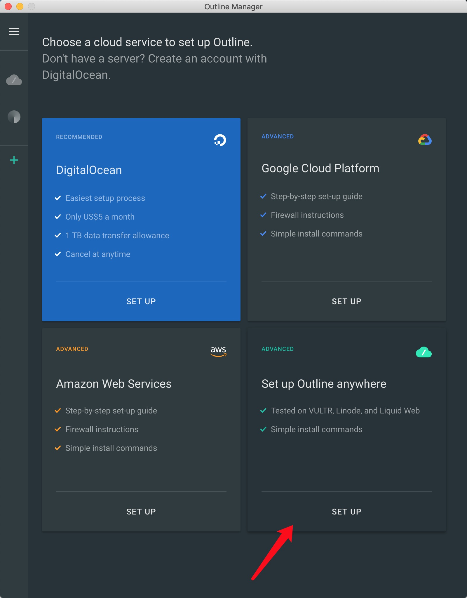
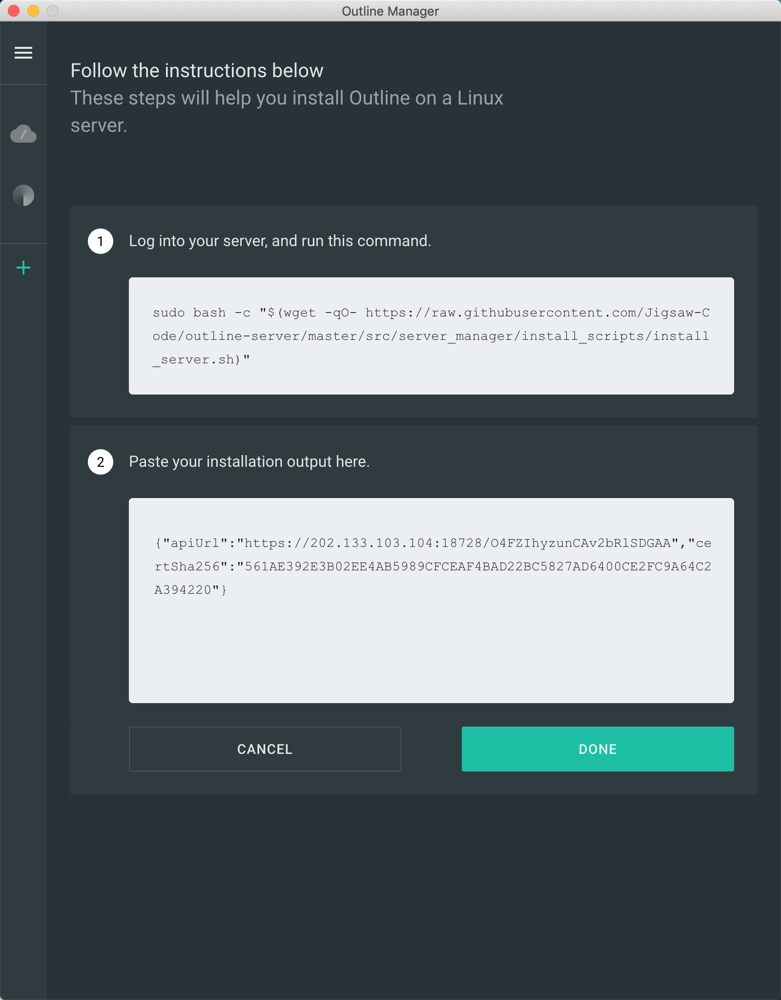

# Outline Server
## 一、install and run Shadowbox

先重启Docker

```sudo service docker restart```

```
sudo bash -c "$(wget -qO- https://raw.githubusercontent.com/Jigsaw-Code/outline-server/master/src/server_manager/install_scripts/install_server.sh)"
```

备用地址

```
sudo bash -c "$(wget -qO- https://raw.githubusercontent.com/tryEvething/outline-server/master/src/server_manager/install_scripts/install_server.sh)"
```
	
如果出现docker: Cannot connect to the Docker daemon at unix:///var/run/docker.sock. Is the docker daemon running?.

解决方法:[https://github.com/Jigsaw-Code/outline-server/issues/39](https://github.com/Jigsaw-Code/outline-server/issues/39)

## 二、防火墙过滤
成功后会返回

	{"apiUrl":"https://202.133.103.104:18728/O4FZIhyzunCAv2bRlSDGAA","certSha256":"561AE392E3B02EE4AB5989CFCEAF4BAD22BC5827AD6400CE2FC9A64C2A394220"}

保存下来,还有一句提示

	Make sure to open the following ports on your firewall, router or cloud provider:
	- Management port 18728, for TCP
	- Access key port 1175, for TCP and UDP

按照提示终端输入

```
firewall-cmd --zone=public --add-port=37720/tcp --permanent
firewall-cmd --zone=public --add-port=14896/tcp --permanent
firewall-cmd --zone=public --add-port=14896/udp --permanent
firewall-cmd --reload
```

[官方提示配置(未成功)](https://github.com/Jigsaw-Code/outline-server/issues/97)

添加防火墙端口后查看是否已开放:

```
firewall-cmd --list-ports
```

## 三、连接服务器
[下载服务端软件](https://github.com/Jigsaw-Code/outline-releases/tree/master/manager)

选择自定义服务器


选择第二项输入之前生成的“apiUrl”，“certSha256”



新用户首次充值可能需要 24 小时的账户验证期，耐心等待即可。

添加Key然后[下载客户端使用](https://getoutline.org/zh-CN/home)