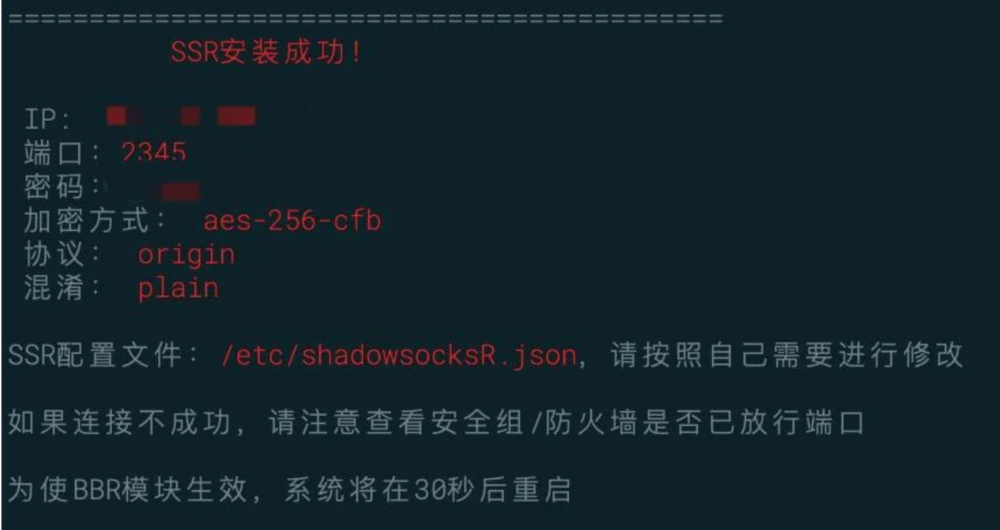
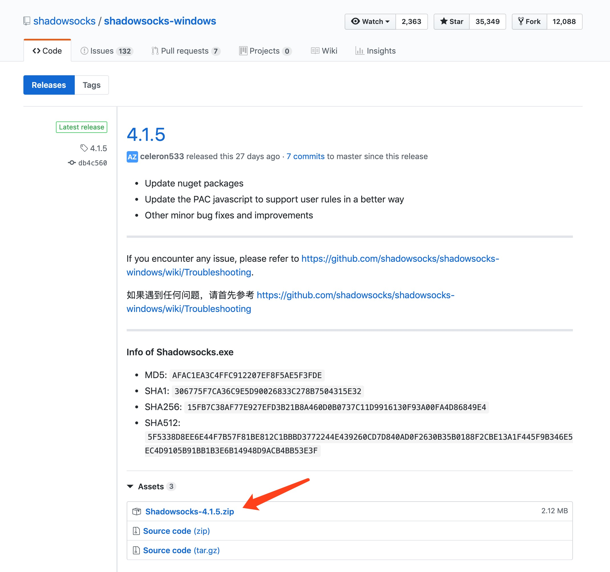
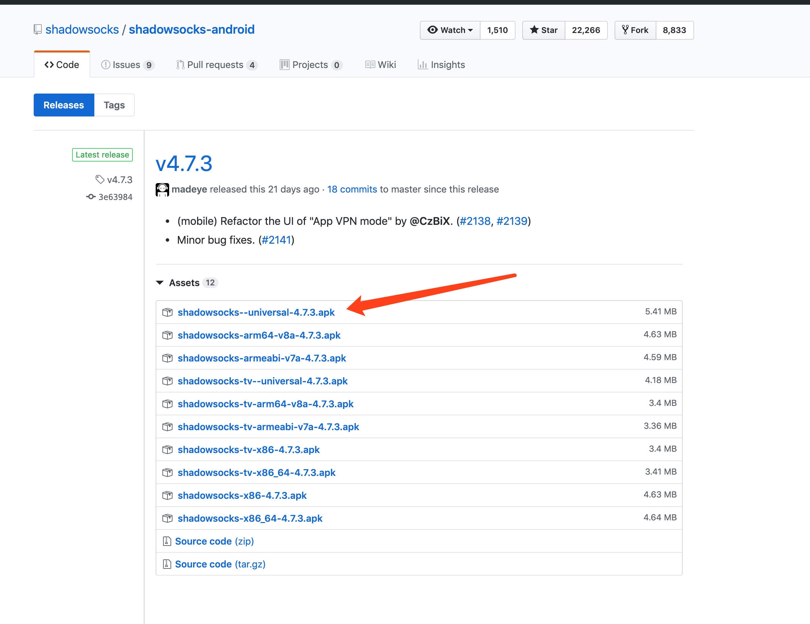
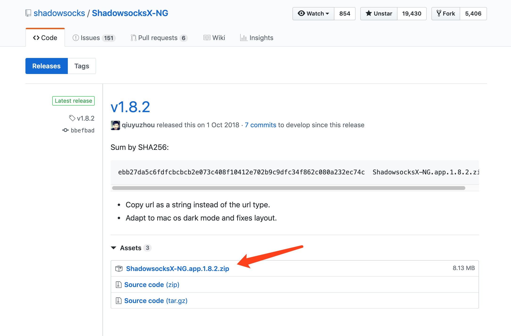

1. [购买初始化](https://www.vultrcn.com/1.html)
2. [测试下这个IP](https://www.ipip.net/ping.php)
如果中国都是丢包 100% 就说明这个IP不能用！删除不能用的机器,然后重新创建一个会分配新的IP.
3. [Xshell 软件连接 Vultr](https://www.vultrcn.com/3.html)
mac使用[FinalShell](http://www.hostbuf.com/t/1059.html)
4. [Vultr 一键搭建Shad0ws0cksR](https://www.vultrcn.com/8.html)
5. [安装锐速提升速度](https://www.vultrcn.com/7.html)
6. 最后下载Shadowrocket软件即可

# Vultr注册安装使用
## 一、注册账户
先点击官网[注册链接](https://www.vultr.com/?ref=7610494)，来到下图所示界面。按照图中提示我们首先在第一个框中填写注册邮箱，然后在第二个框中填写注册密码（长度最少十位，需要至少包含小写字母、大写字母、数字和特殊字符中的三项），最后点击 Create Account 继续即可。

	注意：务必多检查几次注册邮箱，确保填写正确，否则后面会很麻烦！！！

## 二、验证邮箱
点击 Create Account 后，注册邮箱内会收到一封名为“Welcome to Vultr.com”的验证邮件。打开邮件，按照下图提示，我们点击 Verify Your E-mail 前往验证即可。


	没有收到邮件的请检查垃圾箱及拦截记录，或者更换其他邮箱重新注册。注册邮箱必须验证！！！

## 三、充值余额
点击 Verify Your E-mail 后，会来到下图所示界面。因为新注册账户的余额为 0 美元，无法创建服务器，所以我们需要先充值一定金额，然后再去创建服务器。按照下图提示，我们首先点击 Alipay，然后选择 $10，然后勾选 I Agree ...，最后点击 Pay with Alipay 前往付款即可。

新用户首次充值可能需要 24 小时的账户验证期，耐心等待即可。

## 四、创建服务器
充值到账后，我们点击官网[右侧的圆形加号按钮](https://my.vultr.com/deploy/)即可进入创建服务器界面。

平时我们创建的都是云服务器，所以我们需要选择 Vultr Cloud Computer (VC2) 这一项。


**最新版本请选择CentOS 7  的服务器,默认为8**

如上图,一般只需要选择地区,然后选择最实惠的服务器即可,有些有3.5$也可以选择.**不推荐使用最便宜的 $2.5/mo 套餐，默认只有 IPv6 地址，没有 IPv4 地址！！！**

点击 Deploy Now 后，会来到下图所示界面。按照下图提示，红色 Installing 表示服务器初始化中。
点击服务器哪一行进入服务器详情

点击进入后，会来到下图所示界面。在这一界面我们可以获取到很多信息。


左下角红框内三行信息是我们使用 Xshell(Mac使用FinalShell) 这一类管理软件连接服务器时需要用到的 SSH 连接信息。其中 Location 指机房位置，IP Address 指服务器 IP 地址（后面的按钮为复制IP地址），Username 指登录用户名，Password 指登录密码(后面第一个按钮为显示/隐藏，第二个按钮为复制密码)。

## 五、检测服务器
创建完成后不慌,我们先测试下这个服务器是否能用,先测试IP Address是否能连接[https://tools.ipip.net/ping.php](https://tools.ipip.net/ping.php)

如果中国的丢包率都是 100%,除去港澳台地区(如下图),先查看服务器的Status是否为绿色的Running,如果不是,请耐心等待服务器创建完毕,如果是,那么只有删除服务器并再创建一个新的服务器了,重复第四部 创建服务器 知道成功为止


成功的话如下图


还需要检查端口是否打开:[http://coolaf.com/tool/port](http://coolaf.com/tool/port),如果关闭还是删除服务器重复第四部

测试22端口是否打开

当Ping和端口都检测成功后变可以连接服务器进行配置了,

## 六、连接服务器
### 1、下载 FinalShell等连接服务器软件

下载地址：[http://www.hostbuf.com/t/988.html](http://www.hostbuf.com/t/988.html)

官网: [http://www.hostbuf.com/](http://www.hostbuf.com/)

### 2、连接 Vultr 服务器
下载安装完成后打开软件,新建连接,然后粘贴SSH 连接信息 IP Address,Username和Password

点击确定后再打开连接管理器,选择新建的连接,双击或者右键连接

首次连接服务器会弹出SSH安全警告，我们直接点击接受并保存按钮即可，如下图所示。


## 七、搭建 ShadowsocksR 服务器端
使用 FinalShell 软件成功连接服务器后，按照下图提示，我们复制命令到 FinalShell 执行：
```
bash <(curl -sL https://raw.githubusercontent.com/hijkpw/scripts/master/centos_install_ssr.sh)
```

按回车键，屏幕出现“请设置SSR的密码（不输入则随机生成）” 的提示，按照提示设置密码（SSR的密码。例如1234abcd，不是买服务器后台的密码）、端口（SSR的端口，例如12345，不能是22和80）并选择加密方式。

接下来屏幕上开始疯狂出现一堆你看得懂也可能看不懂的东西，如果安装过程中卡住，请耐心等待几分钟；期间网络断开（windows上表现为黑框框中或者顶部标题出现disconnected字样，mac表现为终端出现“closed by remote host”或”broken pipe”），请重新连接后再次执行命令。脚本执行成功后会输出SSR配置，界面如下：




至此,安装已结束,关闭FinalShell,安装好下面对应的平台软件,然后填上之前保存好的配置信息,打开[Google](https://www.google.com/),看看外面的世界吧!

[Windows 客户端](https://github.com/shadowsocks/shadowsocks-windows/releases)

找到最新的版本(一般默认第一个)点击.zip下载

[Android 客户端](https://github.com/shadowsocks/shadowsocks-android/releases)


[Mac 客户端](https://github.com/shadowsocks/ShadowsocksX-NG/releases)


[iPhone 只有美服才有Shadowsocks软件,需要登录一个美服账号(可以淘宝自行购买)](https://itunes.apple.com/us/app/shadowrocket/id932747118)

参考链接:[https://www.vultrcn.com](https://www.vultrcn.com)

平时我们创建的都是云服务器，所以我们需要选择 Vultr Cloud Computer (VC2) 这一项。


## 服务器操作

一键脚本-自动加入开机自启动。

wget http://vpn.ximcx.cn/SSR/SSR bash SSR


卸载方法： 

使用 root 用户登录，运行以下命令：

wget http://vpn.ximcx.cn/SSR/SSR bash SSR uninstall


使用命令： 

启动：/etc/init.d/shadowsocks start 

停止：/etc/init.d/shadowsocks stop 

重启：/etc/init.d/shadowsocks restart 

状态：/etc/init.d/shadowsocks status

配置文件路径：/etc/shadowsocks.json 

日志文件路径：/var/log/shadowsocks.log 

安装路径：/usr/local/shadowsocks/shadowsoks
