1. [购买初始化](https://www.vultrcn.com/1.html)
2. [测试下这个IP](https://www.ipip.net/ping.php)
如果中国都是丢包 100% 就说明这个IP不能用！删除不能用的机器,然后重新创建一个会分配新的IP.
3. [Xshell 软件连接 Vultr](https://www.vultrcn.com/3.html)
mac使用[FinalShell](http://www.hostbuf.com/t/1059.html)
4. [Vultr 一键搭建Shad0ws0cksR](https://www.vultrcn.com/8.html)
5. [安装锐速提升速度](https://www.vultrcn.com/7.html)
6. 最后下载Shadowrocket软件即可

#Vultr注册安装使用
##一、注册账户
先点击官网[注册链接](https://www.vultr.com/?ref=7610494)，来到下图所示界面。按照图中提示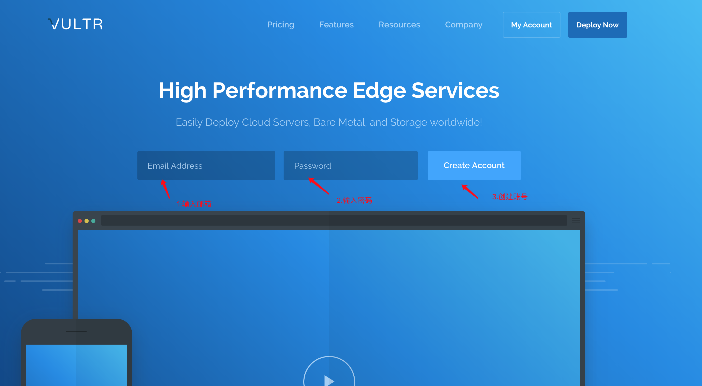我们首先在第一个框中填写注册邮箱，然后在第二个框中填写注册密码（长度最少十位，需要至少包含小写字母、大写字母、数字和特殊字符中的三项），最后点击 Create Account 继续即可。

	注意：务必多检查几次注册邮箱，确保填写正确，否则后面会很麻烦！！！

##二、验证邮箱
点击 Create Account 后，注册邮箱内会收到一封名为“Welcome to Vultr.com”的验证邮件。打开邮件，按照下图提示，我们点击 Verify Your E-mail 前往验证即可。


	没有收到邮件的请检查垃圾箱及拦截记录，或者更换其他邮箱重新注册。注册邮箱必须验证！！！

##三、充值余额
点击 Verify Your E-mail 后，会来到下图所示界面。因为新注册账户的余额为 0 美元，无法创建服务器，所以我们需要先充值一定金额，然后再去创建服务器。按照下图提示，我们首先点击 Alipay，然后选择 $10，然后勾选 I Agree ...，最后点击 Pay with Alipay 前往付款即可。

新用户首次充值可能需要 24 小时的账户验证期，耐心等待即可。

##四、创建服务器
充值到账后，我们点击官网[右侧的圆形加号按钮](https://my.vultr.com/deploy/)即可进入创建服务器界面。

平时我们创建的都是云服务器，所以我们需要选择 Vultr Cloud Computer (VC2) 这一项。
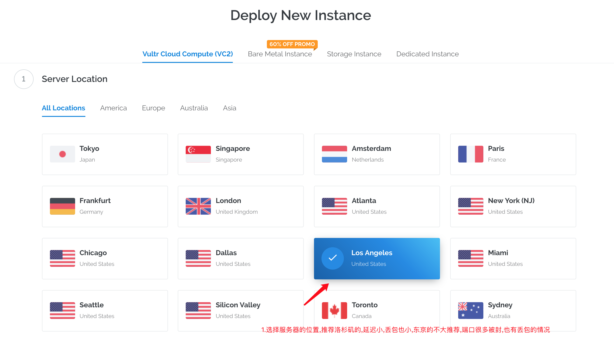
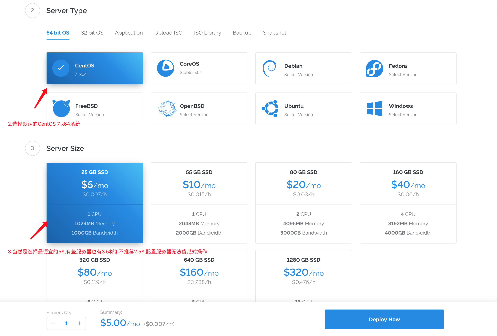
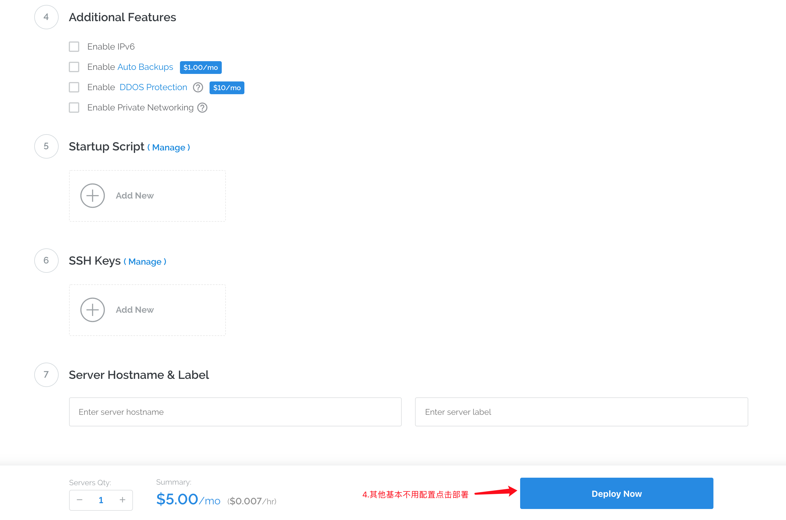
如上图,一般只需要选择地区,然后选择最实惠的服务器即可,有些有3.5$也可以选择.**不推荐使用最便宜的 $2.5/mo 套餐，默认只有 IPv6 地址，没有 IPv4 地址！！！**

点击 Deploy Now 后，会来到下图所示界面。按照下图提示，红色 Installing 表示服务器初始化中。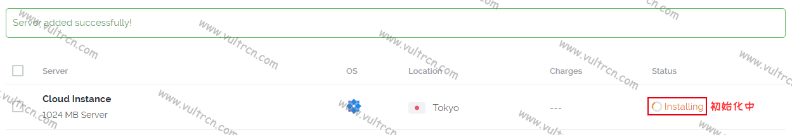
点击服务器哪一行进入服务器详情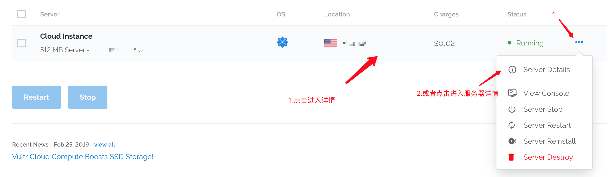

点击进入后，会来到下图所示界面。在这一界面我们可以获取到很多信息。
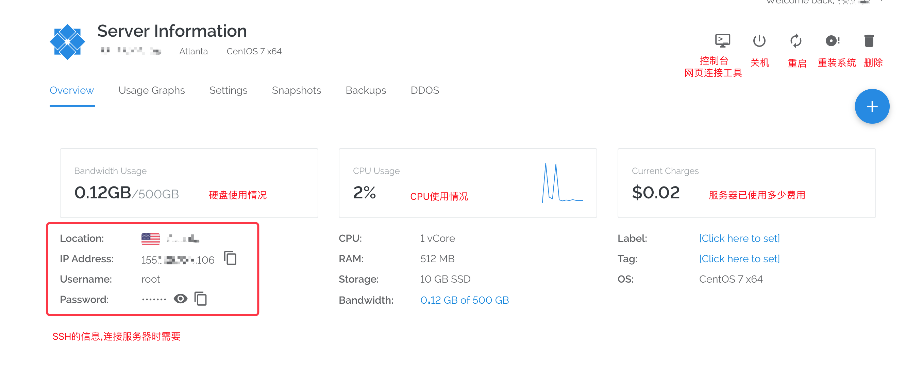

左下角红框内三行信息是我们使用 Xshell(Mac使用FinalShell) 这一类管理软件连接服务器时需要用到的 SSH 连接信息。其中 Location 指机房位置，IP Address 指服务器 IP 地址（后面的按钮为复制IP地址），Username 指登录用户名，Password 指登录密码(后面第一个按钮为显示/隐藏，第二个按钮为复制密码)。

##五、检测服务器
创建完成后不慌,我们先测试下这个服务器是否能用,先测试IP Address是否能连接[https://tools.ipip.net/ping.php](https://tools.ipip.net/ping.php)

如果中国的丢包率都是 100%,除去港澳台地区(如下图),先查看服务器的Status是否为绿色的Running,如果不是,请耐心等待服务器创建完毕,如果是,那么只有删除服务器并再创建一个新的服务器了,重复第四部 创建服务器 知道成功为止
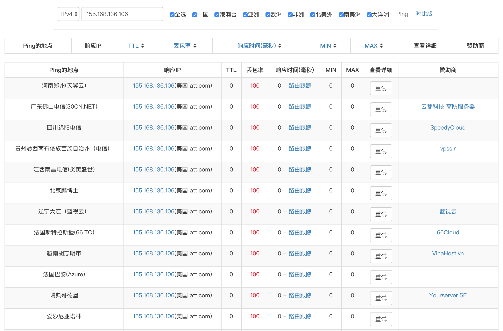

成功的话如下图
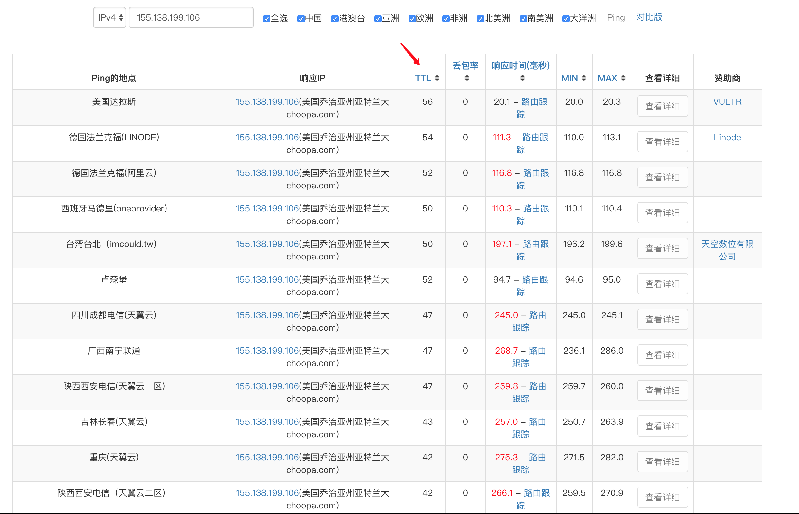

还需要检查端口是否打开:[http://coolaf.com/tool/port](http://coolaf.com/tool/port),如果关闭还是删除服务器重复第四部
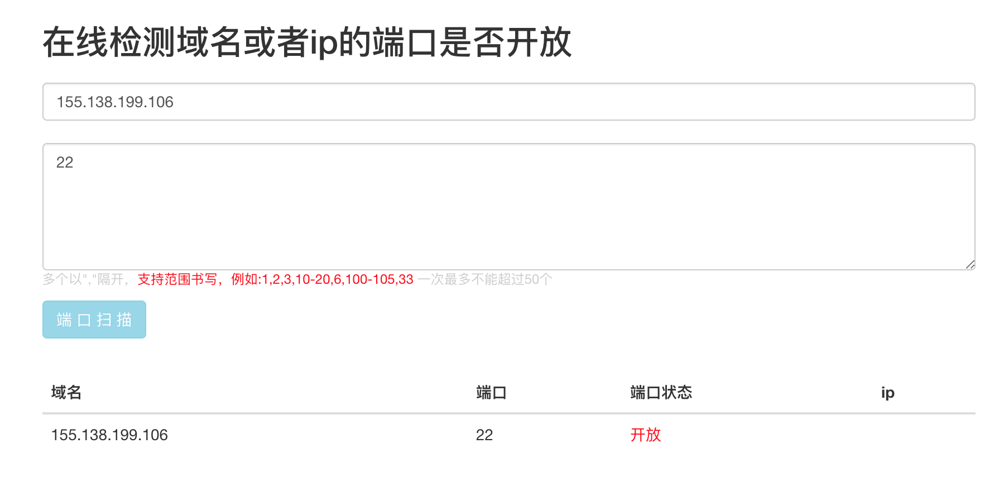
测试22端口是否打开

当Ping和端口都检测成功后变可以连接服务器进行配置了,

##六、连接服务器
###1、下载 FinalShell等连接服务器软件

下载地址：[http://www.hostbuf.com/t/988.html](http://www.hostbuf.com/t/988.html)

官网: [http://www.hostbuf.com/](http://www.hostbuf.com/)

###2、连接 Vultr 服务器
下载安装完成后打开软件,新建连接,然后粘贴SSH 连接信息 IP Address,Username和Password
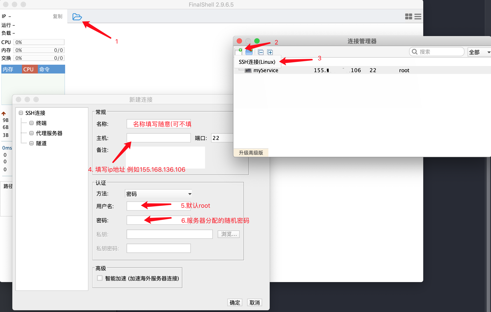
点击确定后再打开连接管理器,选择新建的连接,双击或者右键连接
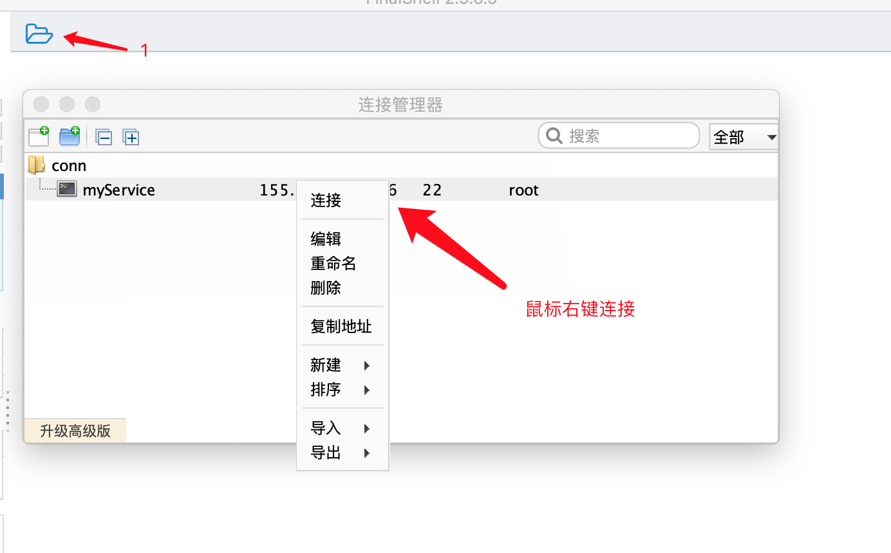
首次连接服务器会弹出SSH安全警告，我们直接点击接受并保存按钮即可，如下图所示。
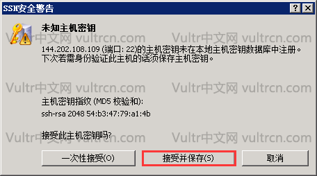
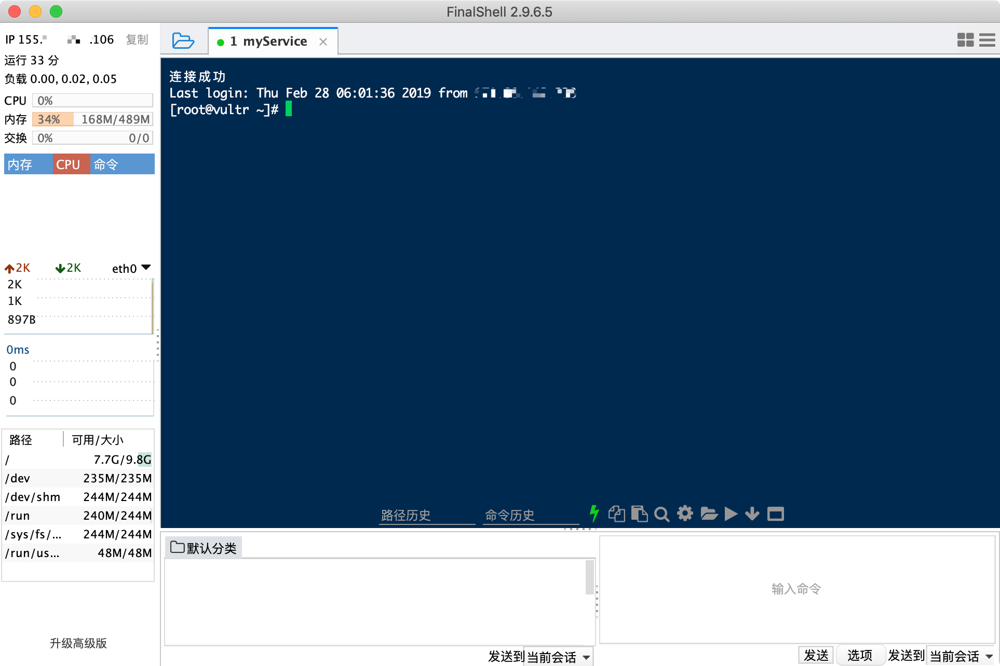

##六、搭建 ShadowsocksR 服务器端
使用 FinalShell 软件成功连接服务器后，按照下图提示，我们复制命令：
```
wget --no-check-certificate -O shadowsocksR.sh https://raw.githubusercontent.com/uxh/shadowsocks_bash/master/shadowsocksR.sh && bash shadowsocksR.sh
```
回到 FinalShell 软件，鼠标右击选择粘贴，回车继续。
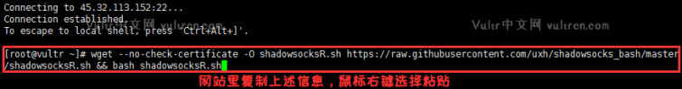
回车后系统会自行下载脚本并运行。按照下图提示，我们依次输入 SSR 的各项连接信息，最后回车继续。

如果报错 Network is unreachable那么说明你选的服务器是2.5 美元的类型,请删除并换成3.5$或者5$的服务器

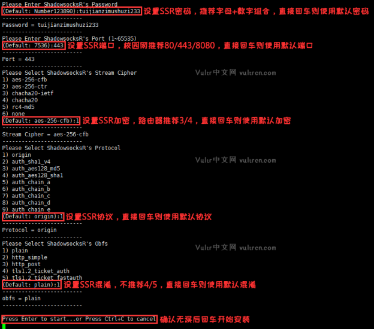

安装过程耗时 2~5 分钟，完成后会来到下图界面，**请把下图中红框内的信息保存下来，使用时需要用到配置信息。**
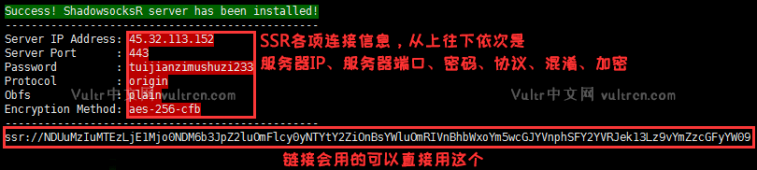

##七、安装 TCP 加速软件
前面虽然已经搭建好了 SSR，但是因为服务器位于国外，连接速度会较慢，所以我们非常必要在服务器上安装 TCP 加速软件来提速。一般大家常用的 TCP 加速软件有锐速和 Google BBR 拥塞控制算法。

复制一下代码粘贴到 FinalShell
```
wget --no-check-certificate -O rskernel.sh https://raw.githubusercontent.com/uxh/shadowsocks_bash/master/rskernel.sh && bash rskernel.sh
```
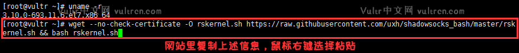
回车后系统会自动下载脚本并执行更换内核命令。按照下图提示，我们可以看到当前系统确实为 CentOS7，等待内核更换完毕后系统会自动重启并断开连接。
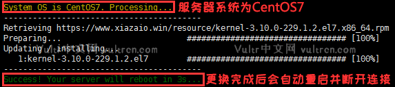

**系统重启后，FinalShell 软件会断开连接**。等待 3~5 分钟服务器即可重启完毕，我们重新连接服务器，按照下图提示，我们继续复制命令：
```
yum install net-tools -y && wget --no-check-certificate -O appex.sh https://raw.githubusercontent.com/0oVicero0/serverSpeeder_Install/master/appex.sh && bash appex.sh install
```
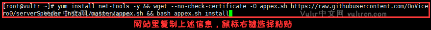
回车后系统会自动下载脚本并执行。按照下图提示，我们直接回车继续即可。
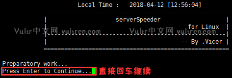

回车继续后系统会自动安装锐速，同时会先后要求我们设置锐速的三项信息。按照下图提示，我们每次都直接回车继续即可。
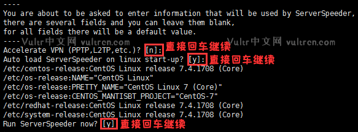

设置完三项信息完成后，系统会完成锐速安装并输出锐速的运行状态。按照下图提示，当出现红框内信息时说明锐速已完成安装并开机自启动。
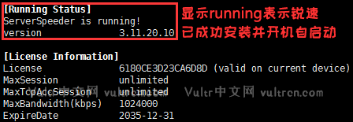

至此,安装已结束,关闭FinalShell,安装好下面对应的平台软件,然后填上之前保存好的配置信息,打开[Google](https://www.google.com/),看看外面的世界吧!

[Windows 客户端](https://curls.fun/Shadowsocks/Shadowsocks-Windows-4.0.9.zip)

[Android 客户端](https://curls.fun/Shadowsocks/ShadowsocksR-Android-3.4.0.8.apk)

[Mac 客户端](https://curls.fun/Shadowsocks/Shadowsocks-MacOS-2.6.3.zip)

[iPhone 需要通过 PP 助手安装 Shadowrocket](https://pro.25pp.com/pp_mac_ios)

参考链接:[https://www.vultrcn.com](https://www.vultrcn.com)
平时我们创建的都是云服务器，所以我们需要选择 Vultr Cloud Computer (VC2) 这一项。
